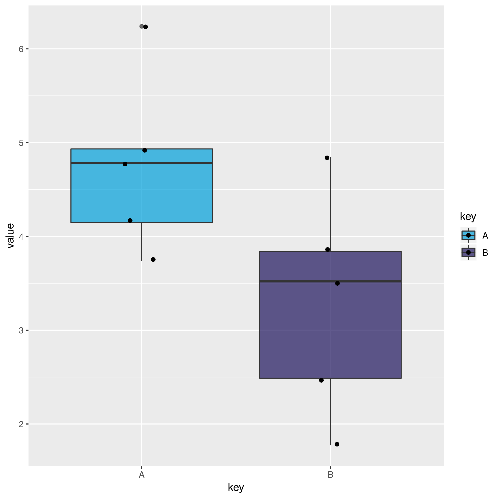
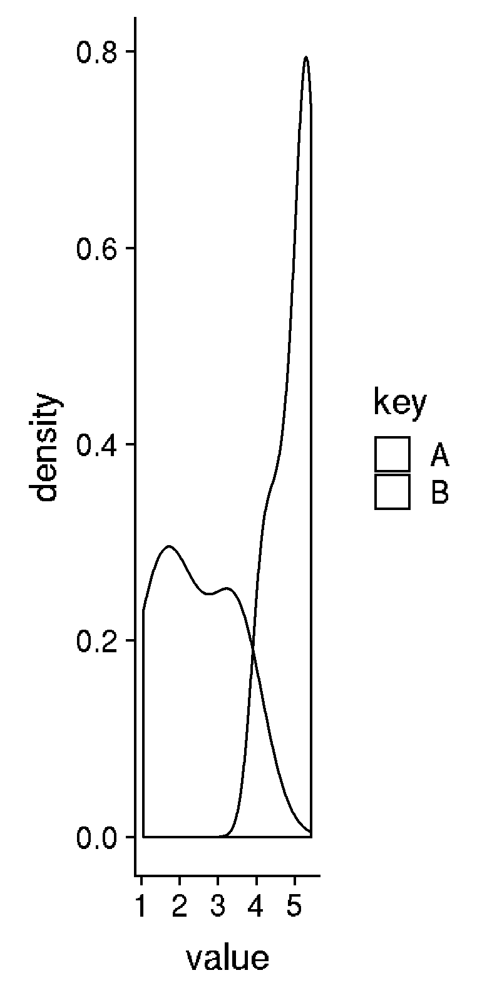

# Hands-on RNA-seq Analysis in Galaxy

## Acknowledgement

_Based on the RNA-Seq workshop by Melbourne Bioinformatics written by Mahtab Mirmomeni, Andrew Lonie, Jessica Chung_ [Original](http://vlsci.github.io/lscc_docs/tutorials/rna_seq_dge_advanced/rna_seq_advanced_tutorial/)

_Modified by David Powell (Monash Bioinformatics Platform)_

_Further Modified by Mark Dunning of Sheffield Bioinformatics Core_

### Sheffield Bioinformatics Core

web : [sbc.shef.ac.uk](https://sbc.shef.ac.uk)  
twitter: [@SheffBioinfCore](https://twitter.com/SheffBioinfCore)  
email: [bioinformatics-core@sheffield.ac.uk](bioinformatics-core@sheffield.ac.uk)

-----

## Tutorial Overview

This tutorial will cover the basics of RNA-seq using Galaxy; a open-source web-based platform for the analysis of biological data. You should gain an appreciation of the tasks involved in a typical RNA-seq analysis and be comfortable with the outputs generated by the Bioinformatician.

### More on Galaxy

The official Galaxy page has many [tutorials](https://galaxyproject.org/learn/) on using the service, and examples of other types of analysis that can be performed on the platform.

Those eventually wanted to perform their own RNA-seq analysis (for example in R), should look out for other courses

### Courses on analysing RNA-seq data in R

- [Sheffield Bioinformatics Core](http://sbc.shef.ac.uk/training/rna-seq-in-r-2019-01-14/)
- [Monash Bioinformatics Platform](http://monashbioinformaticsplatform.github.io/RNAseq-DE-analysis-with-R/)

## Recap

Previous sections have illustrated how to

- [perform quality assessment on our fastq files](01-pre-processing.nb.html#section_2:_quality_assessment_with_fastqc)
- [align fastq files to the reference genome](01-pre-processing.nb.html#section_3:_alignment)
- [visualise the reads in IGV](01-pre-processing.nb.html#section_4_visualise_the_aligned_reads_with_igv)
- [count against a set of reference transcripts](01-pre-processing.nb.html#section_5_quantification_(counting_reads_in_features))

We will now use the counts as the input for a differential expression analysis.

## Differential expression

The term *differential expression* was first used to refer to the process of finding statistically significant genes from a *microarray* gene expression study.

Such methods were developed on the premise that microarray expression values are approximately *normally-distributed* when appropriately transformed (e.g. by using a log$_2$ transformation) so that a modified version of the standard *t-test* can be used. The same test is applied to each gene under investigation yielding a *test statistic*, *fold-change* and *p-value*. Similar methods have been adapted to RNA-seq data to account for the fact that the data are *count-based* and do not follow a normal distribution.

There are several sensible and respected choices for performing a differential expression analysis on RNA-seq data. We will concentrate initally on the `DESeq2` method because it is readily available through Galaxy. [DESeq2](https://bioconductor.org/packages/release/bioc/html/DESeq2.html)
is an R package, that is used for analysing differential expression of RNA-Seq data and can either use exact statistical methods or generalised 
linear models.

The counts have to be normalised first prior to differential expression testing. There are two main biases that need to be accounted for:-

- size of gene
  + *longer* genes will have more reads assigned to them
- library size
  + a sample that is sequenced to a higher depth will receive more reads
  
[This blog](https://www.rna-seqblog.com/rpkm-fpkm-and-tpm-clearly-explained/) provides a nice explanation of the current thinking 

**NGS: RNA Analysis > DESeq2**

In the Galaxy tool panel, under NGS Analysis, select
**NGS: RNA Analysis > DESeq2** and set the parameters as follows:

- **1. Factor level** Batch
- **Count files**  
    - `batch1-htseq`
    - `batch2-htseq`
- **2. Factor level:** Chem
- **Select columns containing control:**  
    - `chem1-htseq`
    - `chem2-htseq`
- Use defaults for the other fields
- Execute

#### 2.  Examine the outputs from the previous step
1.  Examine the `DeSeq2 result file`by
    clicking on the **eye icon**.
    This file is a list of genes sorted by p-value from using DESeq2 to
    perform differential expression analysis.
2.  Examine the `DeSeq2 plots` file. This file has some
    plots from running DESeq2, including PCA and clusteing.
    
*PCA* and hierachical clustering are two common methods for visualising relationships between samples in a high-throughput experiment.

#### 3.  Extract the significant differentially expressed genes.  
Under Basic Tools, click on **Filter and Sort > Filter**:

- **Filter:** `DESeq2 results file`
- **With following condition:** `c7 < 0.05 and (c3 > 1.0 or c3 < -1.0)`
- **Number of header lines to skip:** 1
- Execute

This will keep the genes that have an adjusted p-value (column 7 in the table) of less
or equal to 0.05 and have a fold change of greater than 1 or less than -1. There should be 22 genes in this file.
Rename this file by clicking on the **pencil icon** of and change the name
from "Filter on data x" to `DESeq2_Significant_DE_Genes`

Question: 

Why do you think it is important to use the *adjusted* p-value to select which genes are differentially-expressed. Why might you also want to specify a fold-change cutoff? Discuss with your neighbours

## Interactive exploration of the results with *DEGUST*

- [Degust](http://degust.erc.monash.edu/)

`Degust` is a web tool that can analyse the counts files produced in the step above, to test for differential gene expression. It offers and interactive view of the differential expression results

The input file is a count matrix where each row is a measured gene, and each column is a different biological sample. Within the tool we can configure which samples belong to the different biological groups of interest.

### Create a count matrix

The htseq tool is designed to produce a separate table of counts for each sample. This is not particularly useful for other tools which require the counts to be displayed in a data matrix where each row is a gene and each column is a particular sample in the dataset.tmp 

*RNA Analysis -> Generate count matrix*

- Select the count files from your history *batch1.htseq*, *batch2.htseq*, etc...
- Keep *Column containing gene IDs* and *Column containing gene counts* to 1 and 2 respectively. 
- Rename the output to `raw counts` and Download to your computer

### Uploading the count matrix to Degust

Click on Choose File.
Select the htseq output file. tabular (that you previously downloaded to your computer from Galaxy) and click Open.
Click Upload.
A Configuation page will appear.

For Name type DGE in E coli
For Info columns select Contig
For Analyze server side leave box checked.
For Min read count put 10.
Click Add condition
Add a condition called “Control” and select the LB columns.
Add a condition called “Treament” and select the MG columns.

## References

[1] Nookaew I, Papini M, Pornputtpong N, Scalcinati G, Fagerberg L, Uhlén M, Nielsen J: A comprehensive comparison of RNA-Seq-based transcriptome analysis from reads to differential gene expression and cross-comparison with microarrays: a case study in Saccharomyces cerevisiae. Nucleic Acids Res 2012, 40 (20):10084 – 10097. doi:10.1093/nar/gks804. Epub 2012 Sep 10

[2] Guirguis A, Slape C, Failla L, Saw J, Tremblay C, Powell D, Rossello F, Wei A, Strasser A, Curtis D: PUMA promotes apoptosis of hematopoietic progenitors driving leukemic progression in a mouse model of myelodysplasia. Cell Death Differ. 2016 Jun;23(6)
