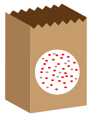
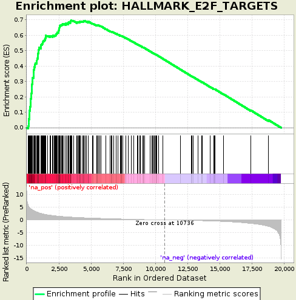

```{r setup, include=FALSE}
knitr::opts_chunk$set(echo = FALSE)
```


```{r echo=FALSE,message=FALSE}
library(limma)
```

# Gene-Ontologies and Annotation

## Gene-Ontology Analysis

In the early days of microarray analysis, people were happy if they got a handful of differentially-expressed genes that they could validate or follow-up. However, with later technologies (and depending on the experimental setup) we might have thousands of statistically-significant results, which no-one has the time to follow-up. Also, we might be interested in pathways / mechanisms that are altered and not just individual genes.

In this section we move towards discovering if our results are ***biologically significant***. Are the genes that we have picked statistical flukes, or are there some commonalities. 

There are two different approaches one might use, and we will cover the theory behind both


    

## Theory Part I: Over-representation analysis

- "Threshold-based": require defintion of a statistical threshold to define list of genes to test (e.g. FDR < 0.01)
- Hypergeometric test or Fisher's Exact test generally used.

The question we are asking here is;

> ***"Are the number of DE genes associated with Theme X significantly greater than what we might expect by chance alone?"***

Where Theme X could be genes belonging to a particular GO (Gene Onotology) term.

Let's imagine that we have a bag full of balls. Each balls represents a gene in the *gene universe*. 
- Paint the balls representing our selected list grey, and paint the rest red.




In this small example, we can define;

- Total number of balls: 40
- Total number of interesting (grey) balls: 10

Now, lets select a number (say, 12) of the balls at random without seeing into the bag and look at what we get


We have picked, at random, 8 grey balls. 

Using simulations, we can repeat the process and look at how many grey we get. The distribution of the data shows what the most-likely values are

```{r echo=FALSE}
#see ?rhyper for argument definition
trials <- rhyper(10000,40,10,12)
hist(trials,xlab = "Number of grey balls")
```

We can count how many times each value is observed

```{r echo=FALSE}
table(trials)
```

Dividing by the number of trials gives a probability of sorts

```{r echo=FALSE}
table(trials)/10000

```

The probability of getting *at least* a certain number can also be computed

```{r echo=FALSE}
cumsum(table(trials)/10000)

```

Back to our example, the distribution of balls (both grey and red) can be expressed as a contingency table, on which we can use a "*Fisher's exact test*".

Total grey balls: 10
Total in subset: 12

```{r echo=FALSE} 
df <- data.frame(Selected = c(8,4), NotSelected = c(2,26))
rownames(df) <- c("Grey", "Red")
df
```


```{r echo=FALSE}
df <- data.frame(Selected = c("a","c","a+c"), NotSelected = c("b","d","b+d"), RowTotal = c("a +b","c+d","a+b+c+d (=n)"))
rownames(df) <- c("Grey", "Red","Column Total")
df
```

The formula for Fishers exact test is;

$$ p = \frac{\binom{a + b}{a}\binom{c +d}{c}}{\binom{n}{a +c}} = \frac{(a+b)!(c+d)!(a+c)!(b+d)!}{a!b!c!d!n!} $$

or less formally;

*P = (ways of choosing grey balls) X (ways of non-grey balls amongst subset) / ways of choosing subset*


The general procedure for performing an over-representation can be summarised as follows:-

- defining the *statistically-significant* genes in your dataset
    + we can be a bit more relaxed when assessing this. sometimes we want as many genes as feasible to be included
- defining the *background* genes; this is the list of all possible genes that could have been identified


## Worked Example: 

We will use the example of 5 breast cancer patients and 5 normals that we performed differential expression on using the degust tool.

The first step is to create a list of *background* genes for the test.

<div class="alert alert-info">
**Text Manipulation** -> **Cut**
</div>

- Download the results file from Degust as a ***tsv*** file, and upload them to Galaxy
- Select the Type of data as *Tabular* when uploading the file
- Cut the column c1 from `Degust.tsv` in your Galaxy history
- Download the resulting object and rename to `background.txt`


Now use the tool **Filter and Sort** -> **Filter:** to select only the significant genes

<div class="alert alert-info">
**Filter and Sort** -> **Filter**
</div>

<div class="alert alert-warning">
Question: Look back at the instructions to filter the DESeq2 results from the previous section. How would you modify

</div>

- use the **Text Manipulation** -> **Cut** command to create a table containing just the names of the differentially-expressed genes. 
- download the table to `de_genes.txt`


## Using GOrilla

There are several popular online tools for performing enrichment analysis

We will be using the online tool [GOrilla](http://cbl-gorilla.cs.technion.ac.il/) to perform the pathways analysis. It has two modes; the first of which accepts a list of *background* and *target* genes


1. Go to http://cbl-gorilla.cs.technion.ac.il/
2. Read the “Running Example”


3. Choose Organism: `Homo sapiens`
4. Choose running mode: `Two unranked lists of genes`
5. Upload `de_genes.txt` as the Target set.
6. Upload `background.txt` as the Background set.
7. Choose an Ontology: `Process`
8. `Search Enriched GO terms`

You should be presented with a graph of enriched GO terms showing the relationship between the terms. Each GO term is coloured according to its statistical significance.

Below the figure is the results table. This links to more information about each GO term, and lists each gene in the category that was found in your list. The enrichment column gives 4 numbers that are used to determine enrichment (similar to the Fisher exact test we saw earlier)

- N, total number of genes (should be the same in all rows)
- B, total number of genes annotated with the GO term
- n, total number of genes that were found in the list you uploaded (same for all rows)
- b, number of genes in the list you uploaded that intersect with this GO term

If you have time, you can also experiment uploading the same genes lists to the online tools [DAVID](https://david.ncifcrf.gov/tools.jsp) and [GeneTrail](https://genetrail2.bioinf.uni-sb.de/)


## Theory Part II: Threshold-free

For these tests, we don't have to specify a statistical threshold and use the test statistics (log fold-change) from *all* genes as the input to the test. The popular *Gene Set Enrichment Analysis (GSEA)* uses this approach. These tests can be used to detect differential expression for a group of genes, even when the effects are too small or there is too little data to detect the genes individually.




The Broad institute provides [a version of GSEA](http://software.broadinstitute.org/gsea/index.jsp) that can be run via a java application. 

Remember that this method requires a sorted list of genes, so we will use a tool within Galaxy to sort our Degust results by log fold change

<div class="alert alert-info">
**Filter and Sort** -> **Sort**
</div>

- Use **Filter and Sort** -> **Sort** to sort the `degust.tsv` 
- The use the **Text Manipulation** -> **Cut** tool to cut columns `c1` and `c3` from the output.
- Download the resulting table, and once downloaded **rename to `gsea_input.rnk`**

## Run the GSEAPreranked tool

You should have already downloaded the gsea java tool from the Broad website. Double-clicking on the file `gsea-3.0.jar` should load the tool

- Load the file you have just created into the tool by clicking the *Load data* button
- Select the *GSEAPreranked* option from tools
- You will need to choose what set of genes to use in the analysis. There are many curated gene sets available through [msigDB](http://software.broadinstitute.org/gsea/msigdb)
- We will use the Hallmark gene sets, but feel free to experiment with others

> hallmark gene sets are coherently expressed signatures derived by aggregating many MSigDB gene sets to represent well-defined biological states or processes.

- Click the *Run* icon at the bottom of the screen
- The bottom-left panel of the GSEA screen should show the progress of the tool as it runs. Once *success** is displayed, you will be able to view the results
- The files `gsea_report_for_..._neg_.....` and `gsea_report_for_...._pos_....` show reports for gene sets that are under- and over-expressed in the study (according to the direction of the log fold-change).

<div class="alert alert-warning">
Question: What are the most enriched pathways? Locate their enrichment plots in the results folder. Make sure that you can understand the plots.

</div>

