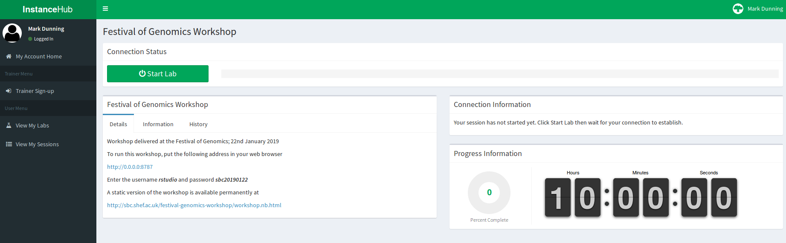
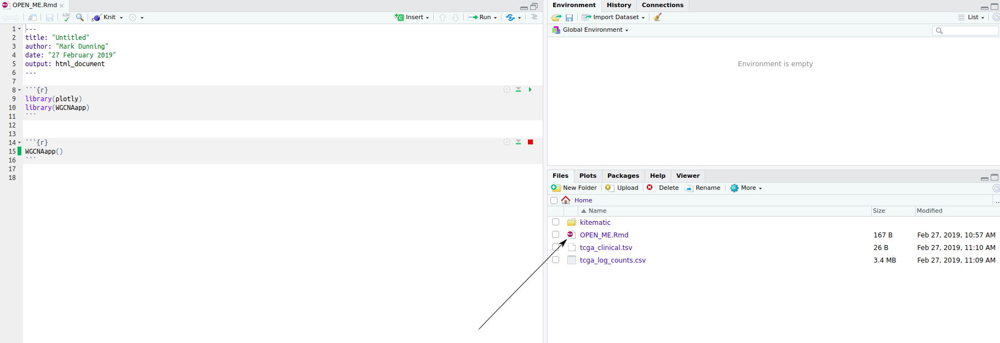
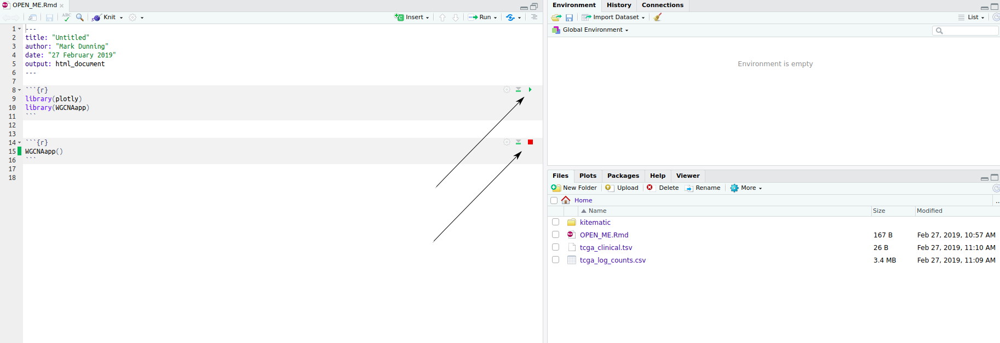
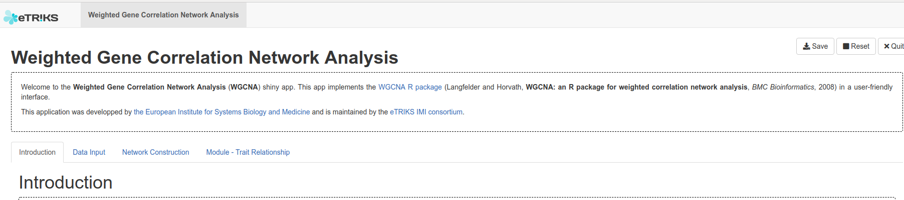

```{r setup, include=FALSE}
knitr::opts_chunk$set(echo = TRUE)
```

# Setup for the WGCNA tutorial

In this course we will demonstrate the running of the WGCNA R pacakge. We take advantage of an WGNCA app developed by the European Institute for Systems Biology and Medicine, but this still requires a working version of R and some packages. To faciliate this process, we have installed everything on the Amazon cloud to use during the practical

## 1. Create an account at InstanceHub

*InstanceHub* is a tool created at The University of Sheffield for creating cloud resources for computing practicals. You will need to go to [instancehub.com](https://www.instancehub.com) and create an account. **Make sure that you specify the same email address that you signed-up to the course**.


## 2. Launch the Lab 

Choose the menu option *View my labs* on the left-hand menu. The lab **WGCNA Tutorial** should be visible. Click the *Participate* button.


## 3. Connect to the lab

Press the *Start Lab* (green) button and wait whilst the lab loads...



Once *Start Lab* has been replaced by *Disconnect*, the *Connection Information* tab will be updated with an IP address etc.


Enter the following address in your web browser 

Replacing **IP_ADDRESS** with the numbers next to **Instance IP** in the *Connection Information* box.

```
http://IP_ADDRESS:8787
```

e.g. 

```
http://3.8.183.247:8787
```

**Do not click Disconnect**

## 4. Click the file `OPEN_ME.Rmd`

You should now have a version of the RStudio interface open in your web browser with all the R code and packages that we are going to need. Click on the file `OPEN_ME.Rmd` in the right-hand panel to display a document with a few lines of R code.



## 5. Open the WGCNA app



The WGCNA app can be opened by running R code from the left-hand panel. Click the green triangles indicated to first load some required libraries and then launch the app. You will probably get a message saying that a *pop-up has been blocked*. Click try again and a new browser tab should open

## 6. Success!



You should now be able to access the interface to the WGCNA app and play with some example data.

## Installation on your own machine after the workshop

### Windows

Install R by downloading and running [this .exe](http://cran.r-project.org/bin/windows/base/release.htm) file from CRAN. Also, please download and run the [RStudio installer for Windows](https://www.rstudio.com/products/rstudio/download/#download). Note that if you have separate user and admin accounts, you should run the installers as administrator (right-click on .exe file and select “Run as administrator” instead of double-clicking). Otherwise problems may occur later, for example when installing R packages.

Then open RStudio and paste the following lines of R code into a console and press Enter

```{r eval=FALSE}
install.packages("BiocManager")
BiocManager::install("tidyverse")
BiocManager::install("VariantAnnotation", version = "3.8")
BiocManager::install("TxDb.Hsapiens.UCSC.hg19.knownGene", version = "3.8")
BiocManager::install("org.Hs.eg.db", version = "3.8")
BiocManager::install("BSgenome.Hsapiens.UCSC.hg19", version = "3.8")
```


### Mac

Install R by downloading and running [this .pkg](http://cran.r-project.org/bin/macosx/R-latest.pkg) file from CRAN. Also, please download and run [the RStudio installer for Mac](https://www.rstudio.com/products/rstudio/download/#download)

Then open RStudio and paste the following lines of R code into a console and press Enter

```{r eval=FALSE}
install.packages("BiocManager")
BiocManager::install("tidyverse")
BiocManager::install("VariantAnnotation", version = "3.8")
BiocManager::install("TxDb.Hsapiens.UCSC.hg19.knownGene", version = "3.8")
BiocManager::install("org.Hs.eg.db", version = "3.8")
BiocManager::install("BSgenome.Hsapiens.UCSC.hg19", version = "3.8")
```

