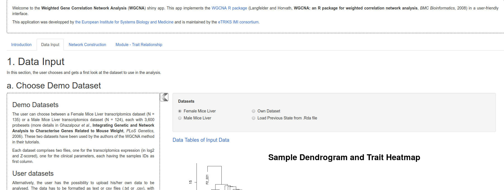
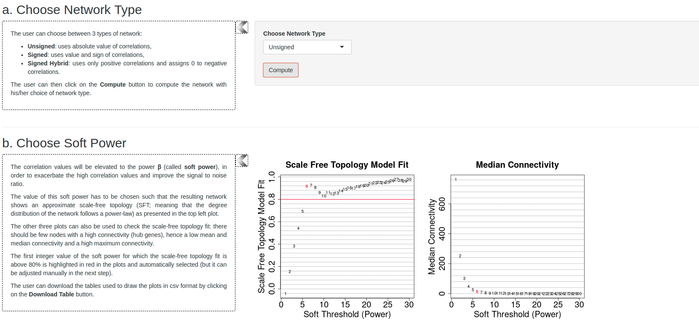

```{r setup, include=FALSE}
knitr::opts_chunk$set(echo = TRUE)
```

# WGCNA Analysis

**W**eighted **G**ene **C**o-expression **N**etwork **A**nalysis is a highly-popular method for identifying de-novo networks of connecting genes from expression data. 

This document is a useful reference for the terminology used in a WGCNA analysis [https://horvath.genetics.ucla.edu/html/CoexpressionNetwork/Rpackages/WGCNA/Tutorials/Simulated-00-Background.pdf](https://horvath.genetics.ucla.edu/html/CoexpressionNetwork/Rpackages/WGCNA/Tutorials/Simulated-00-Background.pdf).

# Setup for the WGCNA tutorial

We take advantage of an "WGNCA app" developed by the European Institute for Systems Biology and Medicine, but this still requires a working version of R and some packages. To faciliate this process, we have installed everything on the Amazon cloud for use during the practical. To run this tutorial on your own laptop after the course, you will need to install R and the relevant packages as described below.

There are various tutorial for running available for running WGCNA available online. 

- https://horvath.genetics.ucla.edu/html/CoexpressionNetwork/Rpackages/WGCNA/Tutorials/

However, they are R-based rather than using the online interface that we will present. 

## 1. Create an account at InstanceHub

*InstanceHub* is a tool created at The University of Sheffield for creating cloud resources for computing practicals. You will need to go to [instancehub.com](https://www.instancehub.com) and create an account. **Make sure that you specify the same email address that you signed-up to the course**.


## 2. Launch the Lab 

Choose the menu option *View my labs* on the left-hand menu. The lab **WGCNA Tutorial** should be visible. Click the *Participate* button.


## 3. Connect to the lab

Press the *Start Lab* (green) button and wait whilst the lab loads...


Once *Start Lab* has been replaced by *Disconnect*, the *Connection Information* tab will be updated with an IP address etc.


Enter the following address in your web browser 

Replacing **IP_ADDRESS** with the numbers next to **Instance IP** in the *Connection Information* box.

```
http://IP_ADDRESS:8787
```

e.g. 

```
http://3.8.183.247:8787
```

**Do not click Disconnect**

## 4. Click the file `OPEN_ME.Rmd`

You should now have a version of the RStudio interface open in your web browser with all the R code and packages that we are going to need. Click on the file `OPEN_ME.Rmd` in the right-hand panel to display a document with a few lines of R code.


## 5. Open the WGCNA app


The WGCNA app can be opened by running R code from the left-hand panel. Click the green triangles indicated to first load some required libraries and then launch the app. You will probably get a message saying that a *pop-up has been blocked*. Click try again and a new browser tab should open

## 6. Success!


You should now be able to access the interface to the WGCNA app and play with some example data.

# Tutorial instructions

## Background to WGNA

Familiarise yourself with some of the terminology used in WGCNA looking at this document

[https://horvath.genetics.ucla.edu/html/CoexpressionNetwork/Rpackages/WGCNA/Tutorials/Simulated-00-Background.pdf](https://horvath.genetics.ucla.edu/html/CoexpressionNetwork/Rpackages/WGCNA/Tutorials/Simulated-00-Background.pdf)

## Load example Female Mice Liver dataset

The *Data Input* tab allows the user to select from a couple of pre-processed datasets, or input their own data. Clicking the *Female Mice Liver* checkbox loads the dataset from *Ghazalpour et al., Integrating Genetic and Network Analysis to Characterise Genes Related to Mouse Weight, PLoS Genetics, 2006* comprising 135 female mice and a subset of 3,500 microarray probes. 

Clicking *Data Tables of Input Data* allows the data to be inspected. Underneath is a clustering dendrogram



## Network Construction

(from the WGCNA tutorial [here](https://horvath.genetics.ucla.edu/html/CoexpressionNetwork/Rpackages/WGCNA/Tutorials/FemaleLiver-02-networkConstr-auto.pdf))



> Constructing a weighted gene network entails the choice of the soft thresholding power β to which co-expression
similarity is raised to calculate adjacency [1]. The authors of [1] have proposed to choose the soft thresholding power
based on the criterion of approximate scale-free topology. We refer the reader to that work for more details; here
we illustrate the use of the function `pickSoftThreshold` that performs the analysis of network topology and aids the
user in choosing a proper soft-thresholding power. The user chooses a set of candidate powers (the function provides
suitable default values), and the function returns a set of network indices that should be inspected, 

The 4 plots in section b) of the *Network construction* tab show the plots that can be used to select the *soft-power* threshold.  We choose the power 6, which is the lowest power for which the scale-free topology fit index curve flattens out upon reaching a high value (in this case, roughly 0.90).

The user can alter the value of soft-power (or stick with the value automatically chosen) and use this to construct the network. Automatic is the easier option. This splits the genes into different *modules*. The clustering dendrogram illustrates module membership (each module is represented by a different colour) and the module assignments can be downloaded along with a report.

**N.B. The module assignments could be used as an input to an online gene-set enrichment tool, such as GOrilla.**

## Module - Trait Relationship

> We quantify associations of individual genes with our trait of interest (weight) by defining Gene Significance GS as
(the absolute value of) the correlation between the gene and the trait. For each module, we also define a quantitative
measure of module membership MM as the correlation of the module eigengene and the gene expression profile. This
allows us to quantify the similarity of all genes on the array to every module.

The first plot in this tab allows the user to assess how the various modules that have been identified are related to different clinical traits. Modules are in the rows of the plot, traits in columns. Darker colour shades indicate greater correlation and red / blue indicate positive and negative correlation respectively. The values presented in the table can also be downloaded using the *Download Module Trait Association* button.

The Gene-Trait analysis allows the user to drill further down into the modules and discover which genes are most influential for each module, and whether modules might be driven by only one or two samples. We can download the values for a particular module - trait pairing using the *Download Gene Significance and Module Membership*.

The links between genes in a module can be visualised in the section *c. Network of Modules*. A specific module (named according to colour) can be selected in the *Modules* box and clicking the *Plot Network* button creates an interactive visualisation. The network can be zoomed and names of genes will appear if a particular node is clicked on.


### Analysis in R

For those familiar with R, the steps that we have just performed via the app can also be performed in R by following the following tutorials

- https://horvath.genetics.ucla.edu/html/CoexpressionNetwork/Rpackages/WGCNA/Tutorials/FemaleLiver-01-dataInput.pdf
- https://horvath.genetics.ucla.edu/html/CoexpressionNetwork/Rpackages/WGCNA/Tutorials/FemaleLiver-02-networkConstr-auto.pdf
- https://horvath.genetics.ucla.edu/html/CoexpressionNetwork/Rpackages/WGCNA/Tutorials/FemaleLiver-03-relateModsToExt.pdf
- https://horvath.genetics.ucla.edu/html/CoexpressionNetwork/Rpackages/WGCNA/Tutorials/FemaleLiver-04-Interfacing.pdf
- https://horvath.genetics.ucla.edu/html/CoexpressionNetwork/Rpackages/WGCNA/Tutorials/FemaleLiver-05-Visualization.pdf

## Analysis on the TCGA dataset

WGCNA can also be applied to RNA-seq data provided they are transformed into the correct format. The counts for the TCGA breast cancer dataset have been transformed onto a log$_2$ scale and are available [here](tcga_wgcna_counts.csv) along with a file containing the [clinical assignments](tcga_clinical.tsv). A subset of genes was taken to reduce the computational requirements. Using the WGCNA app, these data can be uploaded via the *Data Input* tab. Repeat the steps from above to compute gene networks from this dataset. Some of the plots may not work, but you should still be able to create a network.

## Installation on your own machine after the workshop

### Windows

Install R by downloading and running [this .exe](http://cran.r-project.org/bin/windows/base/release.htm) file from CRAN. Also, please download and run the [RStudio installer for Windows](https://www.rstudio.com/products/rstudio/download/#download). Note that if you have separate user and admin accounts, you should run the installers as administrator (right-click on .exe file and select “Run as administrator” instead of double-clicking). Otherwise problems may occur later, for example when installing R packages.

Then open RStudio and paste the following lines of R code into a console and press Enter

```{r eval=FALSE}
install.packages("BiocManager")
BiocManager::install("preprocessCore")
BiocManager::install("impute")
BiocManager::install("AnnotationDbi")
BiocManager::install("GO.db")
install.packages(c("shiny", "WGCNA", "stringr", "DT", "networkD3", "gplots","plotly", "rmarkdown"))
```

The app itself can be downloading from google drive [https://drive.google.com/drive/folders/1UJK8yfYmR0vB5BTYiBtzxDWJ2Pp2y4Z6?usp=sharing](https://drive.google.com/drive/folders/1UJK8yfYmR0vB5BTYiBtzxDWJ2Pp2y4Z6?usp=sharing). Once downloaded, it can be installed in R with the following command (replacing *path_where_you_downloaded_the_pacakge* with the path to the directory containing the file downloaded from google drive)

```{r eval=FALSE}
install.packages("path_where_you_downloaded_the_package/WGCNAapp_1.0.tar.gz",
repos=NULL, type="source")
```


### Mac

Install R by downloading and running [this .pkg](http://cran.r-project.org/bin/macosx/R-latest.pkg) file from CRAN. Also, please download and run [the RStudio installer for Mac](https://www.rstudio.com/products/rstudio/download/#download)

Then open RStudio and paste the following lines of R code into a console and press Enter

```{r eval=FALSE}
install.packages("BiocManager")
BiocManager::install("preprocessCore")
BiocManager::install("impute")
BiocManager::install("AnnotationDbi")
BiocManager::install("GO.db")
install.packages(c("shiny", "WGCNA", "stringr", "DT", "networkD3", "gplots","plotly", "rmarkdown"))
```

The app itself can be downloading from google drive [https://drive.google.com/drive/folders/1UJK8yfYmR0vB5BTYiBtzxDWJ2Pp2y4Z6?usp=sharing](https://drive.google.com/drive/folders/1UJK8yfYmR0vB5BTYiBtzxDWJ2Pp2y4Z6?usp=sharing). Once downloaded, it can be installed in R with the following command (replacing *path_where_you_downloaded_the_pacakge* with the path to the directory containing the file downloaded from google drive)

```{r eval=FALSE}
install.packages("path_where_you_downloaded_the_package/WGCNAapp_1.0.tar.gz",
repos=NULL, type="source")
```

# References

[1] B. Zhang and S. Horvath. A general framework for weighted gene co-expression network analysis. Statistical
Applications in Genetics and Molecular Biology, 4(1):Article 17, 2005.