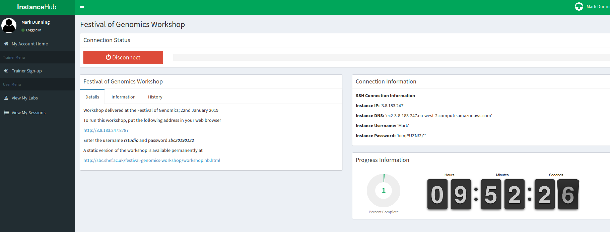

```{r setup, include=FALSE}
knitr::opts_chunk$set(echo = TRUE)
```

# WGCNA Analysis

**W**eighted **G**ene **C**o-expression **N**etwork **A**nalysis is a highly-popular method for identifying de-novo networks of connecting genes from expression data. 

This document is a useful reference for the terminology used in a WGCNA analysis [https://horvath.genetics.ucla.edu/html/CoexpressionNetwork/Rpackages/WGCNA/Tutorials/Simulated-00-Background.pdf](https://horvath.genetics.ucla.edu/html/CoexpressionNetwork/Rpackages/WGCNA/Tutorials/Simulated-00-Background.pdf).

# Setup for the WGCNA tutorial

We take advantage of an "WGNCA app" developed by the European Institute for Systems Biology and Medicine, but this still requires a working version of R and some packages. To faciliate this process, we have installed everything on the Amazon cloud for use during the practical. To run this tutorial on your own laptop after the course, you will need to install R and the relevant packages as described below.

## 1. Create an account at InstanceHub

*InstanceHub* is a tool created at The University of Sheffield for creating cloud resources for computing practicals. You will need to go to [instancehub.com](https://www.instancehub.com) and create an account. **Make sure that you specify the same email address that you signed-up to the course**.


## 2. Launch the Lab 

Choose the menu option *View my labs* on the left-hand menu. The lab **WGCNA Tutorial** should be visible. Click the *Participate* button.


## 3. Connect to the lab

Press the *Start Lab* (green) button and wait whilst the lab loads...


Once *Start Lab* has been replaced by *Disconnect*, the *Connection Information* tab will be updated with an IP address etc.



Enter the following address in your web browser 

Replacing **IP_ADDRESS** with the numbers next to **Instance IP** in the *Connection Information* box.

```
http://IP_ADDRESS:8787
```

e.g. 

```
http://3.8.183.247:8787
```

**Do not click Disconnect**

## 4. Click the file `OPEN_ME.Rmd`

You should now have a version of the RStudio interface open in your web browser with all the R code and packages that we are going to need. Click on the file `OPEN_ME.Rmd` in the right-hand panel to display a document with a few lines of R code.


## 5. Open the WGCNA app


The WGCNA app can be opened by running R code from the left-hand panel. Click the green triangles indicated to first load some required libraries and then launch the app. You will probably get a message saying that a *pop-up has been blocked*. Click try again and a new browser tab should open

## 6. Success!


You should now be able to access the interface to the WGCNA app and play with some example data.

# Tutorial instructions

## Background to WGNA

Familiarise yourself with some of the terminology used in WGCNA looking at this document

[https://horvath.genetics.ucla.edu/html/CoexpressionNetwork/Rpackages/WGCNA/Tutorials/Simulated-00-Background.pdf](https://horvath.genetics.ucla.edu/html/CoexpressionNetwork/Rpackages/WGCNA/Tutorials/Simulated-00-Background.pdf)

## Load example Female Mice Liver dataset

The *Data Input* tab allows the user to select from a couple of pre-processed datasets, or input their own data. Clicking the *Female Mice Liver* checkbox loads the dataset from *Ghazalpour et al., Integrating Genetic and Network Analysis to Characterise Genes Related to Mouse Weight, PLoS Genetics, 2006* comprising 135 female mice and a subset of 3,500 microarray probes. 

Clicking *Data Tables of Input Data* allows the data to be inspected. Underneath is a clustering dendrogram


## Network Construction

This tab presents the results of WGCNA's network construction step. Sections a) and b)


## Analysis in R

For those familiar with R, the steps that we have just performed via the app can also be performed in R by following the following tutorials

- https://horvath.genetics.ucla.edu/html/CoexpressionNetwork/Rpackages/WGCNA/Tutorials/FemaleLiver-01-dataInput.pdf
- https://horvath.genetics.ucla.edu/html/CoexpressionNetwork/Rpackages/WGCNA/Tutorials/FemaleLiver-02-networkConstr-auto.pdf
- https://horvath.genetics.ucla.edu/html/CoexpressionNetwork/Rpackages/WGCNA/Tutorials/FemaleLiver-03-relateModsToExt.pdf
- https://horvath.genetics.ucla.edu/html/CoexpressionNetwork/Rpackages/WGCNA/Tutorials/FemaleLiver-04-Interfacing.pdf
- https://horvath.genetics.ucla.edu/html/CoexpressionNetwork/Rpackages/WGCNA/Tutorials/FemaleLiver-05-Visualization.pdf

## Installation on your own machine after the workshop

### Windows

Install R by downloading and running [this .exe](http://cran.r-project.org/bin/windows/base/release.htm) file from CRAN. Also, please download and run the [RStudio installer for Windows](https://www.rstudio.com/products/rstudio/download/#download). Note that if you have separate user and admin accounts, you should run the installers as administrator (right-click on .exe file and select “Run as administrator” instead of double-clicking). Otherwise problems may occur later, for example when installing R packages.

Then open RStudio and paste the following lines of R code into a console and press Enter

```{r eval=FALSE}
install.packages("BiocManager")
BiocManager::install("preprocessCore")
BiocManager::install("impute")
BiocManager::install("AnnotationDbi")
BiocManager::install("GO.db")
install.packages(c("shiny", "WGCNA", "stringr", "DT", "networkD3", "gplots","plotly", "rmarkdown"))
```

The app itself can be downloading from google drive [https://drive.google.com/drive/folders/1UJK8yfYmR0vB5BTYiBtzxDWJ2Pp2y4Z6?usp=sharing](https://drive.google.com/drive/folders/1UJK8yfYmR0vB5BTYiBtzxDWJ2Pp2y4Z6?usp=sharing). Once downloaded, it can be installed in R with the following command (replacing *path_where_you_downloaded_the_pacakge* with the path to the directory containing the file downloaded from google drive)

```{r eval=FALSE}
install.packages("path_where_you_downloaded_the_package/WGCNAapp_1.0.tar.gz",
repos=NULL, type="source")
```


### Mac

Install R by downloading and running [this .pkg](http://cran.r-project.org/bin/macosx/R-latest.pkg) file from CRAN. Also, please download and run [the RStudio installer for Mac](https://www.rstudio.com/products/rstudio/download/#download)

Then open RStudio and paste the following lines of R code into a console and press Enter

```{r eval=FALSE}
install.packages("BiocManager")
BiocManager::install("preprocessCore")
BiocManager::install("impute")
BiocManager::install("AnnotationDbi")
BiocManager::install("GO.db")
install.packages(c("shiny", "WGCNA", "stringr", "DT", "networkD3", "gplots","plotly", "rmarkdown"))
```

The app itself can be downloading from google drive [https://drive.google.com/drive/folders/1UJK8yfYmR0vB5BTYiBtzxDWJ2Pp2y4Z6?usp=sharing](https://drive.google.com/drive/folders/1UJK8yfYmR0vB5BTYiBtzxDWJ2Pp2y4Z6?usp=sharing). Once downloaded, it can be installed in R with the following command (replacing *path_where_you_downloaded_the_pacakge* with the path to the directory containing the file downloaded from google drive)

```{r eval=FALSE}
install.packages("path_where_you_downloaded_the_package/WGCNAapp_1.0.tar.gz",
repos=NULL, type="source")
```
