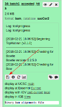

<style> @import url('style.css'); </style>


# Hands-on RNA-seq Analysis in Galaxy

## Acknowledgement

_Based on the RNA-Seq workshop by Melbourne Bioinformatics written by Mahtab Mirmomeni, Andrew Lonie, Jessica Chung_ [Original](http://vlsci.github.io/lscc_docs/tutorials/rna_seq_dge_advanced/rna_seq_advanced_tutorial/)

_Modified by David Powell (Monash Bioinformatics Platform)_

_Further Modified by Mark Dunning of Sheffield Bioinformatics Core_


### Sheffield Bioinformatics Core
web : [sbc.shef.ac.uk](https://sbc.shef.ac.uk)  
twitter: [@SheffBioinfCore](https://twitter.com/SheffBioinfCore)  
email: [bioinformatics-core@sheffield.ac.uk](bioinformatics-core@sheffield.ac.uk)

-----

## Tutorial Overview

This tutorial will cover the basics of RNA-seq using Galaxy; a open-source web-based platform for the analysis of biological data. You should gain an appreciation of the tasks involved in a typical RNA-seq analysis and be comfortable with the outputs generated by the Bioinformatician.

### More on Galaxy

The official Galaxy page has many [tutorials](https://galaxyproject.org/learn/) on using the service, and examples of other types of analysis that can be performed on the platform.

Those eventually wanted to perform their own RNA-seq analysis (for example in R), should look out for other courses

### Courses on analysing RNA-seq data in R

- [Cancer Research Uk Bioinformatics Core](https://bioinformatics-core-shared-training.github.io/RNAseq-R/)
- [Monash Bioinformatics Platform](http://monashbioinformaticsplatform.github.io/RNAseq-DE-analysis-with-R/)


-----

## Background [15 min]

#### Where do the data in this tutorial come from?
The data for this tutorial is from the paper, *A comprehensive comparison of
RNA-Seq-based transcriptome analysis from reads to differential gene expression
and cross-comparison with microarrays: a case study in Saccharomyces
cerevisiae* by Nookaew et al. [1] which studies S.cerevisiae strain CEN.PK
113-7D (yeast) under two different metabolic conditions: glucose-excess (batch)
or glucose-limited (chemostat).

The RNA-Seq data has been uploaded in NCBI, short read archive (SRA), with
accession SRS307298. There are 6 samples in total-- two treatments with
three biological replicates each sequenced paired-end.  We have selected only
the first read, and only two replicates of each condition to keep the data small
for this workshop.

We have extracted chromosome I reads from the samples to make the
tutorial a suitable length. 

### Reminder about Experimental Design

Modern sequencing technologies are extremely sophisticated and give an accurate picture of an individuals genome or transcriptome. However, if the experiment has not been design appropriately to address the biological question of interest, then the data generated may be useless. 


R.A. Fisher


> To consult the statistician after an experiment is finished is often merely to ask him to conduct a post mortem examination. He can perhaps say what the experiment died of. 

Preferably speak to a statistician in advance of performing your experiments!

<iframe width="560" height="315" src="https://www.youtube.com/embed/Hz1fyhVOjr4" frameborder="0" allow="autoplay; encrypted-media" allowfullscreen></iframe>

-----

### Reminder of analysis workflow

Image from https://ycl6.gitbooks.io/rna-seq-data-analysis/


For this tutorial, we will assume that the *wet-lab* stages of the experiment have been performed and we are now in the right-hand branch of the workflow. In this tutorial we will demonstrate the steps of **Quality assessment**, **alignment**, **quantification** and **differential expression testing**.


## Section 1: Preparation [15 min]
#### 1.  Register as a new user on one of the public Galaxy servers

- https://galaxy-mel.genome.edu.au/galaxy/
- http://galaxy-tut.genome.edu.au/galaxy/
- https://galaxy-qld.genome.edu.au/galaxy
- https://galaxy.hidelab.org/

**Make sure you check your email to activate your account**

#### 2.  Import the RNA-seq data for the workshop.

We can going to import the [*fastq* files](https://en.wikipedia.org/wiki/FASTQ_format) for this experiment. This is a standard format for storing raw sequencing reads and their associated quality scores. Each read is described by 4 lines in the file:-


The quality scores are [ASCII](http://ascii-code.com/) representations of how confident we are that a particular base has been called correctly. Letters that are further along the alphabet indicate higher confidence. This is important when trying to identify types of genome variation such as single base changes, but is also indicative of the overall quality of the sequencing. Different scales have been employed over time (resulting in a different set of characters appearing in the file). We will need to tell Galaxy which scale has been used in order that we can process the data correctly.


You can import the data by:

1.  In the tool panel located on the left, under Basic Tools select **Get
    Data > Upload File**. Click on the **Paste/Fetch data** button on the
    bottom section of the pop-up window.
2.  Upload the sequence data by pasting the following links into the text
    input area.
    These two files are single-end samples from the batch condition
    (glucose-excess). Make sure the type is specified as 'fastqsanger'
    when uploading.

    <div class="code">
    https://swift.rc.nectar.org.au:8888/v1/AUTH_a3929895f9e94089ad042c9900e1ee82/RNAseqDGE_ADVNCD/batch1_chrI_1.fastq
    <br>
    https://swift.rc.nectar.org.au:8888/v1/AUTH_a3929895f9e94089ad042c9900e1ee82/RNAseqDGE_ADVNCD/batch2_chrI_1.fastq
    <br>
    </div>

    These two files are single-end samples from the chem condition
    (glucose-limited). Make sure the type is specified as 'fastqsanger'
    when uploading.

    <div class="code">
    https://swift.rc.nectar.org.au:8888/v1/AUTH_a3929895f9e94089ad042c9900e1ee82/RNAseqDGE_ADVNCD/chem1_chrI_1.fastq
    <br>
    https://swift.rc.nectar.org.au:8888/v1/AUTH_a3929895f9e94089ad042c9900e1ee82/RNAseqDGE_ADVNCD/chem2_chrI_1.fastq
    <br>
    </div>
    Then, upload this file of gene definitions. You do not need to specify
    the type for this file as Galaxy will auto-detect the file as a GTF
    file.
    <div class="code">
    https://swift.rc.nectar.org.au:8888/v1/AUTH_a3929895f9e94089ad042c9900e1ee82/RNAseqDGE_ADVNCD/genes.gtf
    </div>
3.  You should now have these 5 files in your history:
    - `batch1_chrI_1.fastq`
    - `batch2_chrI_1.fastq`
    - `chem1_chrI_1.fastq`
    - `chem2_chrI_1.fastq`
    - `genes.gtf`

    These files can be renamed by clicking the **pen icon** if you wish.

    **Note:** Low quality reads have already been trimmed.

-----

## Section 2: Quality assessment with FastQC

[FastQC](https://www.bioinformatics.babraham.ac.uk/projects/fastqc/) is a popular tool from [Babraham Institute Bioinformatics Group](https://www.bioinformatics.babraham.ac.uk/index.html) used for *quality assessment* of sequencing data. Most Bioinformatics pipelines will use FastQC, or similar tools in the first stage of the analysis. The [documentation](https://www.bioinformatics.babraham.ac.uk/projects/fastqc/Help/) for FastQC will help you to interpret the plots and stats produced by the tool. A traffic light system is used to alert the user's attention to possible issues. However, it is worth bearing in mind that the tool is blind to the particular type of sequencing you are performing (i.e. whole-genome, ChIP-seq, RNA-seq), so some warnings might be expected due to the nature of your experiment.

- From the left hand tool panel in Galaxy, under *NGS ANALYSIS*, select *NGS: QC and manipulation -> FastQC*
- Select one of the FASTQ files as input and *Execute* the tool.
- When the tool finishes running, you should have an HTML file in your History. Click on the eye icon to view the various quality metrics.

Look at the generated FastQC metrics. This data looks pretty good - high per-base quality scores (most above 30).


## Section 3: Alignment [30 mins]

In this section we map the reads in our FASTQ files to a reference genome. As
these reads originate from mRNA, we expect some of them will cross exon/intron
boundaries when we align them to the reference genome. Tophat is a splice-aware
mapper for RNA-seq reads that is based on Bowtie. It uses the mapping results
from Bowtie to identify splice junctions between exons. More information on
Tophat can be found [here](https://ccb.jhu.edu/software/tophat/index.shtml).


#### 1.  Map/align the reads with Tophat to the S. cerevisiae reference
In the left tool panel menu, under NGS Analysis, select
**NGS: RNA Analysis > Tophat** and set the parameters as follows:  

- **Is this single-end or paired-end data?** Single-end (as individual datasets)  
- **RNA-Seq FASTQ file, forward reads:**  
(Click on the **multiple datasets icon** and select all four of the
FASTQ files)
    - `batch1_chrI_1.fastq`
    - `batch2_chrI_1.fastq`
    - `chem1_chrI_1.fastq`
    - `chem2_chrI_1.fastq`

- **Use a built in reference genome or own from your history:** Use
built-in genome
- **Select a reference genome:** S. cerevisiae June 2008 (SGD/SacCer2)
(sacCer2)
- Use defaults for the other fields
- Execute


Note: This may take a few minutes, depending on how busy the server is.


#### 2.  Rename the output files
You should have 5 output files for each of the FASTQ input files:

- **Tophat on data 1: accepted_hits:** This is a BAM file containing
  sequence alignment data of the reads. This file contains the location
  of where the reads mapped to in the reference genome. We will examine
  this file more closely in the next step.
- **Tophat on data 1: splice junctions:** This file lists all the places
  where TopHat had to split a read into two pieces to span an exon
  junction.
- **Tophat on data 1 deletions** and **Tophat on data 1: insertions:**
  These files list small insertions or deletions found in the reads.
  Since we are working with synthetic reads we can ignore Tophat for
  Illumina data 1:insertions Tophat for Illumina data 1:deletions for now.
- **Tophat on data 1: align_summary:** This file gives some mapping
  statistics including the number of reads mapped and the mapping rate.

You should have a total of 20 Tophat output files in your history.

Rename the 4 accepted\_hits files into a more meaningful name (e.g.
'Tophat on data 1: accepted_hits' to 'batch1-accepted_hits.bam')
by using the **pen icon** next to the file.


### About the `bam` file format

Unlike most of Bioinfomatics, a *single standard* file format has emerged for aligned reads. Moreoever, this file format is consistent regardless of whether you have DNA-seq, RNA-seq, ChIP-seq... data. 


## The `.sam` file

- **S**equence **A**lignment/**M**ap (sam) 
- The output from an aligner such as `bwa`
- Same format regardless of sequencing protocol (i.e. RNA-seq, ChIP-seq, DNA-seq etc)
- May contain un-mapped reads
- Potentially large size on disk; ~100s of Gb
    + Can be manipulated with standard unix tools; e.g. *cat*, *head*, *grep*, *more*, *less*....
- Official specification can be [obtained online](http://samtools.github.io/hts-specs/SAMv1.pdf): -
- We normally work on a compressed version called a `.bam` file. See later.
- *Header* lines starting with an `@` character, followed by tab-delimited lines
    + Header gives information about the alignment and references sequences used


The first part of the header lists the names (`SN`) of the sequences (chromosomes) used in alignment, their length (`LN`) and a *md5sum* "[digital fingerprint](https://en.wikipedia.org/wiki/Md5sum)" of the `.fasta` file used for alignment (`M5`).

```
@HD	VN:1.5	SO:coordinate	GO:none
@SQ	SN:1	LN:249250621	M5:1b22b98cdeb4a9304cb5d48026a85128
@SQ	SN:2	LN:243199373	M5:a0d9851da00400dec1098a9255ac712e
@SQ	SN:3	LN:198022430	M5:fdfd811849cc2fadebc929bb925902e5
@SQ	SN:4	LN:191154276	M5:23dccd106897542ad87d2765d28a19a1
.....
.....

```

Next we can define the *read groups* present in the file which we can use to identify which sequencing library, sequencing centre, Lane, sample name etc.

```
@RG	ID:SRR077850	CN:bi	LB:Solexa-42057	PL:illumina	PU:ILLUMINA	SM:NA06984
@RG	ID:SRR081675	CN:bi	LB:Solexa-42316	PL:illumina	PU:ILLUMINA	SM:NA06984
@RG	ID:SRR080818	CN:bi	LB:Solexa-44770	PL:illumina	PU:ILLUMINA	SM:NA06984
@RG	ID:SRR084838	CN:bi	LB:Solexa-42316	PL:illumina	PU:ILLUMINA	SM:NA06984
@RG	ID:SRR081730	CN:bi	LB:Solexa-42316	PL:illumina	PU:ILLUMINA	SM:NA06984
.....
.....

```

Finally, we have a section where we can record the processing steps used to derive the file
```
@PG	ID:MosaikAligner	CL:/share/home/wardag/programs/MOSAIK/bin/MosaikAligner -in /scratch/wardag/NA06984.SRR077850.mapped.illumina.mosaik.CEU.SINGLE.20111114/NA06984.SRR077850.mapped.illumina.mosaik.CEU.SINGLE.20111114.mkb -out
....
....

```

Next is a *tab-delimited* section that describes the alignment of each sequence in detail. 

```
SRR081708.237649	163	1	10003	6	1S67M	=	10041	105	GACCCTGACCCTAACCCTGACCCTGACCCTAACCCTGACCCTGACCCTAACCCTGACCCTAACCCTAA	S=<====<<>=><?=?=?>==@??;?>@@@=??@@????@??@?>?@@<@>@'@=?=??=<=>?>?=Q	ZA:Z:<&;0;0;;308;68M;68><@;0;0;;27;;>MD:Z:5A11A5A11A5A11A13	RG:Z:SRR081708	NM:i:6	OQ:Z:GEGFFFEGGGDGDGGGDGA?DCDD:GGGDGDCFGFDDFFFCCCBEBFDABDD-D:EEEE=D=DDDDC:

```


Column | Official Name | Brief
------ | -------------- | -----------
1      | QNAME          | Sequence ID
2      | FLAG           | Sequence quality expressed as a bitwise flag
3      | RNAME          | Chromosome
4      | POS            | Start Position
5      | MAPQ           | Mapping Quality
6      | CIGAR          | Describes positions of matches, insertions, deletions w.r.t reference
7      | RNEXT          | Ref. name of mate / next read
8      | PNEXT          | Postion of mate / next read
9      | TLEN           | Observed Template length
10     | SEQ            | Sequence
11     | QUAL           | Base Qualities

There can also be all manner of optional tags as extra columns introduce by an aligner or downstream analysis tool. A common use is the `RG` tag which refers back to the read groups in the header.

Unlike the `.fastq` files, where we had a separate file for forward and reverse reads, the `.sam` file contains all reads. Reads that are paired with each other should appear in consecutive lines in the `.sam` file generated by an aligner. Otherwise it is more common for the file to be sorted according to genomic coordinates. The paired reads should share the same sequence ID in the first column (sometimes with a `/1` or `/2` to indicate which is which).


## Dr Mark Dunning presents....Fun with flags!

The *"flags"* in the sam file can represent useful QC information

  + Read is unmapped
  + Read is paired / unpaired
  + Read failed QC
  + Read is a PCR duplicate (see later)

The combination of any of these properties is used to derive a numeric value


For instance, a particular read has a flag of 163


### Derivation

There is a set of properties that a read can possess. If a particular property is observed, a corresponding power of 2 is added multiplied by 1. The final value is derived by summing all the powers of 2.


```
 	ReadHasProperty 	Binary 	MultiplyBy
isPaired 	TRUE 	1 	1
isProperPair 	TRUE 	1 	2
isUnmappedQuery 	FALSE 	0 	4
hasUnmappedMate 	FALSE 	0 	8
isMinusStrand 	FALSE 	0 	16
isMateMinusStrand 	TRUE 	1 	32
isFirstMateRead 	FALSE 	0 	64
isSecondMateRead 	TRUE 	1 	128
isSecondaryAlignment 	FALSE 	0 	256
isNotPassingQualityControls 	FALSE 	0 	512
isDuplicate 	FALSE 	0 	1024

```
Value of flag is given by 
```
1x1 + 1x2 + 0x4 + 0x8 + 0x16 + 1x32 + 0x64 + 1x128 + 0x256 + 0x512 + 0x1024 = 163
```

See also

- https://broadinstitute.github.io/picard/explain-flags.html

## Have a CIGAR!


The ***CIGAR*** (**C**ompact **I**diosyncratic **G**apped **Alignment** **R**eport) string is a way of encoding the match between a given sequence and the position it has been assigned in the genome. It is comprised by a series of letters and numbers to indicate how many consecutive bases have that mapping.


 
 Code  | Description
------------- | -------------
M  | alignment match
I  | insertion
D  | deletion
N  | skipped
S  | soft-clipping
H  | hard-clipping


e.g.

- `68M`
    + 68 bases matching the reference
- `1S67M`
    + 1 soft-clipped read followed by 67 matches
- `15M87N70M90N16M`
    + 15 matches following by 87 bases skipped followed by 70 matches etc.

Rather than dealing with `.sam` files, we usually analyse a `.bam` file.

#### [Optional] Convert BAM to SAM

It useful to understand the BAM/SAM format.  Convert one of your BAM files to SAM format, and
view the text within Galaxy
1.  **NGS: SAM Tools> BAM-to-SAM convert BAM to SAM** and select one of you BAM files
2.  Click on the eye of the resulting file to view the SAM alignments.
3.  Look through the alignments, which chromosome are the aligning to?  Can you see any indels in the CIGAR string?

-----

#### 3  Visualise the aligned reads with IGV

Download the bam files you have created in the previous step by clicking the disk icon on the right-hand panel. Make sure to click both the **Download dataset** and **Download index** buttons. We will now visualise the alignments using the Integrative Genomics Viewer (IGV).



- http://software.broadinstitute.org/software/igv/
- Go to *Downloads*
- Launch with 1.2Gb
- Click on igv24_mm.jnlp file that is downloaded


## Introducing the IGV Browser

Arguably the most-important tool you will learn about in this course is [IGV](https://www.broadinstitute.org/igv/). Whilst tools like R are very powerful and allow you to perform statistical analyses and test hypotheses, there is no substitute for ***looking at the data***. A trained-eye can quite quickly get a sense of the data quality before any computational analyses have been run. Futhermore, as the person requesting the sequencing, you probably know a lot about the biological context of the samples and what to expect. 

Many of the exercises in the course will use IGV, so you will have plenty of time to practice.

## Introduction

- IGV has been developed by the Broad Institute and is able to display most kinds of genomic data
    + expression
    + ChIP
    + whole-genome resequencing
    + shRNA
- It is a *Java* desktop application and can be run either locally of from the Broad website
    + You have a link to IGV on the taskbar on the left the screen in-front of you
- To run IGV yourself you will need to agree to the license and [download the version for your OS](http://www.broadinstitute.org/software/igv/download)

## A quick tour of IGV
For more details

- Full set of slides from [MRC Clinical Sciences Centre](http://mrccsc.github.io/IGV_course/igv.html#/)
- IGV tutorial from the [Griffth lab - WashU](https://github.com/griffithlab/rnaseq_tutorial/wiki/IGV-Tutorial)


1) Sample information panel
    - Information about samples you have loaded
    - e.g. Sample ID, Gender, Age, Tumour / Normal
    
2) Genome Navigation panel
    - Jump to a genomic region in `Chr:Start-End` format
    - Jump to a gene symbol of interest
    
3) Data panel
    - Your sequencing reads will be displayed here
    - Or whatever data you have loaded
        + see information on [accepted file formats](http://www.broadinstitute.org/software/igv/RecommendedFileFormats)

4) Attribute panel
    - Gene locations
    - Genome sequence (if zoomed-in at appropriate level)
    - Proteins
    
## Example

Go to ***File*** -> ***Load from file*** and select the aligned `bam` files from `Tophat`. Note that the index files `.bai` need to be present in the same directory. However, you only need to click on the `.bam`


- The black dotted vertical lines indicates the centre of the view
- Each of the grey pointed rectangles represents a sequencing reads
    + whether the pointed bit is on the left or right indicates if the read is forward or reverse.
- A coverage track is also generated
- You should see the read that we described in detail in the previous section by *hover*ing over the reads to display the information from the `.bam` file


The view in IGV is not static and we can scroll-along the genome by holding-down the left mouse in the data panel and dragging left and right

## Viewing preferences

IGV allows us to configure many aspects of the data display

***Menu:-*** ***View -> Alignments***


It's worth noting that the display settings may be showing fewer reads than you have (*downsampling*) in order to conserve memory. Also, some QC-fail or PCR duplicates may be filtered.

We also have some options on how to display the reads themselves, which we can acccess by right-clicking on the bam track

Sorting alignments by:-

  - start
  - strand
  - base
  - mapping quality
  - insert size
  
The reads themselves can also be coloured according to

  - insert size
  - read strand
  - sample

Experiment with the various settings by right clicking the read alignment track and toggling the options. Think about which would be best for specific tasks (e.g. quality control, SNP calling, CNV finding). We will re-visit these options later when we come to examine particular variant calls

## Additional data tracks

Additional data tracks are also available on the IGV server. These include useful genome annotation tracks, such as:-

- GC percentage
- CpG islands
- Repeat regions
- dbSNP calls


## Section 4. Quantification (Counting reads in features) [30 min]

HTSeq-count creates a count matrix using the number of the reads from each bam
file that map to the genomic features in the genes.gtf. For each feature (a
gene for example) a count matrix shows how many reads were mapped to this
feature.

1.  Use HTSeq-count to count the number of reads for each feature.  
    In the left tool panel menu, under NGS Analysis, select
    **NGS Analysis > htseq-count*** and set the parameters as follows:  
    - **Gene model (GFF) file to count reads over from your current history:** genes.gtf
    - **bam/sam file from your history:**  
      (Select all six bam files using the shift key.)
        - `batch1-accepted_hits.bam`
    - Use defaults for the other fields
    - Execute

2.  Examine the outputted matrix by using the **eye icon**.  
    Each column corresponds to a sample and each row corresponds to a gene. By
    sight, see if you can find a gene you think is differentially expressed
    from looking at the counts.

We now have a count matrix, with a count against each corresponding sample. We
will use this matrix in later sections to calculate the differentially
expressed genes.


## Section 5: edgeR  [30 min]

[edgeR](https://bioconductor.org/packages/release/bioc/html/edgeR.html)
is an R package, that is used for analysing differential expression of
RNA-Seq data and can either use exact statistical methods or generalised
linear models.

#### 1.  Generate a list of differentially expressed genes using edgeR
In the Galaxy tool panel, under NGS Analysis, select
**NGS: RNA Analysis > Differential_Count** and set the parameters as follows:

- **Select an input matrix - rows are contigs, columns are counts for each
  sample:** bams to DGE count matrix_htseqsams2mx.xls
- **Title for job outputs:** Differential\_Counts\_edgeR
- **Treatment Name:** Batch
- **Select columns containing treatment:**  
    - `batch1-accepted_hits.bam`
    - `batch2-accepted_hits.bam`
- **Control Name:** Chem
- **Select columns containing control:**  
    - `chem1-accepted_hits.bam`
    - `chem2-accepted_hits.bam`
- **Run this model using edgeR:** Run edgeR
- Use defaults for the other fields
- Execute

#### 2.  Examine the outputs from the previous step
1.  Examine the `Differential_Counts_edgeR_topTable_edgeR.xls` file by
    clicking on the **eye icon**.
    This file is a list of genes sorted by p-value from using EdgeR to
    perform differential expression analysis.
2.  Examine the `Differential_Counts_edgeR.htm`l file. This file has some
    output logs and plots from running edgeR. If you are familiar with R,
    you can examine the R code used for analysis by scrolling to the bottom
    of the file, and clicking `Differential_Counts.Rscript` to download the
    Rscript file.  
    If you are curious about the statistical methods edgeR uses, you can
    read the [edgeR user's guide at
    Bioconductor](https://bioconductor.org/packages/release/bioc/html/edgeR.html).

#### 3.  Extract the significant differentially expressed genes.  
Under Basic Tools, click on **Filter and Sort > Filter**:

- **Filter:** `Differential_Counts_edgeR_topTable_edgeR.xls`
- **With following condition:** c6 <= 0.05
- **Number of header lines to skip:** 1
- Execute

This will keep the genes that have an adjusted p-value (column 6 in the table) of less
or equal to 0.05. There should be 47 genes in this file.
Rename this file by clicking on the **pencil icon** of and change the name
from "Filter on data x" to `edgeR_Significant_DE_Genes`

-----

## Section 5: DEseq2  [30 min]

[DESeq2](https://bioconductor.org/packages/release/bioc/html/DESeq2.html
is an R package, that is used for analysing differential expression of
RNA-Seq data and can either use exact statistical methods or generalised
linear models.

To use this tool, you will have to use the **htseq-count** tool to obtain counts from each aligned bam file (**Section 4 - alternative tool**).

In the Galaxy tool panel, under NGS Analysis, select
**NGS: RNA Analysis > DESeq2** and set the parameters as follows:


- **1. Factor level** Batch
- **Count files**  
    - `batch1-htseq`
    - `batch2-htseq`
- **2. Factor level:** Chem
- **Select columns containing control:**  
    - `chem1-htseq`
    - `chem2-htseq`
- Use defaults for the other fields
- Execute

#### 2.  Examine the outputs from the previous step
1.  Examine the `DeSeq2 result file`by
    clicking on the **eye icon**.
    This file is a list of genes sorted by p-value from using DESeq2 to
    perform differential expression analysis.
2.  Examine the `DeSeq2 plots` file. This file has some
    plots from running DESeq2, including PCA and clustering showing relationships between samples

#### 3.  Extract the significant differentially expressed genes.  
Under Basic Tools, click on **Filter and Sort > Filter**:

- **Filter:** `DESeq2 results file`
- **With following condition:** c7 <= 0.05
- **Number of header lines to skip:** 1
- Execute

This will keep the genes that have an adjusted p-value (column 7 in the table) of less
or equal to 0.05. There should be 40 genes in this file.
Rename this file by clicking on the **pencil icon** of and change the name
from "Filter on data x" to `DESeq2_Significant_DE_Genes`


## References

[1] Nookaew I, Papini M, Pornputtpong N, Scalcinati G, Fagerberg L, Uhlén M, Nielsen J: A comprehensive comparison of RNA-Seq-based transcriptome analysis from reads to differential gene expression and cross-comparison with microarrays: a case study in Saccharomyces cerevisiae. Nucleic Acids Res 2012, 40 (20):10084 – 10097. doi:10.1093/nar/gks804. Epub 2012 Sep 10

[2] Guirguis A, Slape C, Failla L, Saw J, Tremblay C, Powell D, Rossello F, Wei A, Strasser A, Curtis D: PUMA promotes apoptosis of hematopoietic progenitors driving leukemic progression in a mouse model of myelodysplasia. Cell Death Differ. 2016 Jun;23(6)
