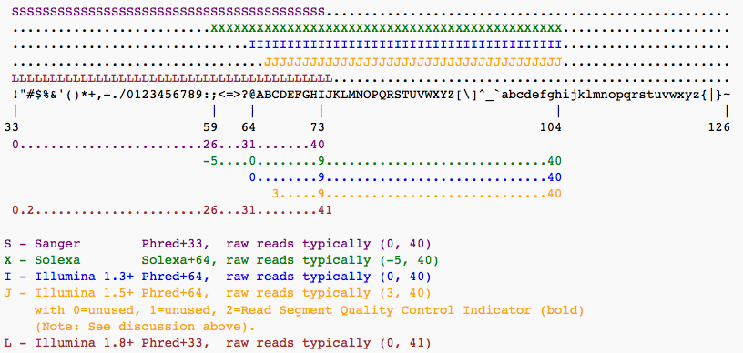

# Hands-on RNA-seq Analysis in Galaxy

## Acknowledgement

_Based on the RNA-Seq workshop by Melbourne Bioinformatics written by Mahtab Mirmomeni, Andrew Lonie, Jessica Chung_ [Original](http://vlsci.github.io/lscc_docs/tutorials/rna_seq_dge_advanced/rna_seq_advanced_tutorial/)

_Modified by David Powell_

_Exercise based on Galaxy Training materials at [https://galaxyproject.github.io/training-material/topics/transcriptomics/tutorials/ref-based/tutorial.html](https://galaxyproject.github.io/training-material/topics/transcriptomics/tutorials/ref-based/tutorial.html)

### Sheffield Bioinformatics Core
web : [sbc.shef.ac.uk](https://sbc.shef.ac.uk)  
twitter: [@SheffBioinfCore](https://twitter.com/SheffBioinfCore)  
email: [bioinformatics-core@sheffield.ac.uk](bioinformatics-core@sheffield.ac.uk)

-----

## Tutorial Overview

This tutorial will cover the basics of RNA-seq using Galaxy; a open-source web-based platform for the analysis of biological data. You should gain an appreciation of the tasks involved in a typical RNA-seq analysis, starting from raw reads to generating a list of differentially-expressed genes.

-----

## Background [15 min]

#### Where does the data in this tutorial come from?
The data for this tutorial is from the paper, *A comprehensive comparison of
RNA-Seq-based transcriptome analysis from reads to differential gene expression
and cross-comparison with microarrays: a case study in Saccharomyces
cerevisiae* by Nookaew et al. [1] which studies S.cerevisiae strain CEN.PK
113-7D (yeast) under two different metabolic conditions: glucose-excess (batch)
or glucose-limited (chemostat).

The RNA-Seq data has been uploaded in NCBI, short read archive (SRA), with
accession SRS307298. There are 6 samples in total-- two treatments with
three biological replicates each sequenced paired-end.  We have selected only
the first read, and only two replicates of each condition to keep the data small
for this workshop.

We have extracted chromosome I reads from the samples to make the
tutorial a suitable length. This has implications, as discussed in section 8.

-----

## Section 1: Preparation [15 min]
#### 1.  Register as a new user on our Monash Galaxy server
1.  Open a browser and go to a Galaxy server : [galaxy.erc.monash.edu/galaxy](http://galaxy.erc.monash.edu/galaxy/)

2.  Register as a new user by clicking **User > Register** on the top
    dark-grey bar. Alternatively, if you already have an account, login by
    clicking **User > Login**.

#### 2.  Import the RNA-seq data for the workshop.

We can going to import the [*fastq* files](https://en.wikipedia.org/wiki/FASTQ_format) for this experiment. This is a standard format for storing raw sequencing reads and their associated quality scores. Each read is described by 4 lines in the file:-

The quality scores are [ASCII](http://ascii-code.com/) representations of the base call probability. Different scales are possible (resulting in a different set of characters appearing in the file). We will need to tell Galaxy which scale has been used in order that we can process the data correctly.

You can import the data by:

1.  In the tool panel located on the left, under Basic Tools select **Get
    Data > Upload File**. Click on the **Paste/Fetch data** button on the
    bottom section of the pop-up window.
2.  Upload the sequence data by pasting the following links into the text
    input area.
    These two files are single-end samples from the batch condition
    (glucose-excess). Make sure the type is specified as 'fastqsanger'
    when uploading.

    

    https://swift.rc.nectar.org.au:8888/v1/AUTH_a3929895f9e94089ad042c9900e1ee82/RNAseqDGE_ADVNCD/batch1_chrI_1.fastq
     
    https://swift.rc.nectar.org.au:8888/v1/AUTH_a3929895f9e94089ad042c9900e1ee82/RNAseqDGE_ADVNCD/batch2_chrI_1.fastq
     
    

    These two files are single-end samples from the chem condition
    (glucose-limited). Make sure the type is specified as 'fastqsanger'
    when uploading.

    

    https://swift.rc.nectar.org.au:8888/v1/AUTH_a3929895f9e94089ad042c9900e1ee82/RNAseqDGE_ADVNCD/chem1_chrI_1.fastq
     
    https://swift.rc.nectar.org.au:8888/v1/AUTH_a3929895f9e94089ad042c9900e1ee82/RNAseqDGE_ADVNCD/chem2_chrI_1.fastq
     
    

    Then, upload this file of gene definitions. You do not need to specify
    the type for this file as Galaxy will auto-detect the file as a GTF
    file.
    

    https://swift.rc.nectar.org.au:8888/v1/AUTH_a3929895f9e94089ad042c9900e1ee82/RNAseqDGE_ADVNCD/genes.gtf
    

3.  You should now have these 5 files in your history:
    - `batch1_chrI_1.fastq`
    - `batch2_chrI_1.fastq`
    - `chem1_chrI_1.fastq`
    - `chem2_chrI_1.fastq`
    - `genes.gtf`

    These files can be renamed by clicking the **pen icon** if you wish.

    **Note:** Low quality reads have already been trimmed.

-----

## Section 2: FastQC

[FastQC](https://www.bioinformatics.babraham.ac.uk/projects/fastqc/) is a popular tool from [Babraham Institute Bioinformatics Group](https://www.bioinformatics.babraham.ac.uk/index.html) used for *quality assessment* of sequencing data. The [documentation](https://www.bioinformatics.babraham.ac.uk/projects/fastqc/Help/) for FastQC will help you to interpret the plots and stats produced by the tool. A traffic light system is used to alert the user's attention to possible issues. However, it is worth bearing in mind that the tool is blind to the particular type of sequencing you are performing (i.e. whole-genome, ChIP-seq, RNA-seq), so some warnings might be expected due to the nature of your experiment.

- From the left hand tool panel in Galaxy, under *NGS ANALYSIS*, select *NGS: QC and manipulation -> FastQC*
- Select one of the FASTQ files as input and *Execute* the tool.
- When the tool finishes running, you should have an HTML file in your History. Click on the eye icon to view the various quality metrics.

Look at the generated FastQC metrics. This data looks pretty good - high per-base quality scores (most above 30).

## Section 3: Alignment [30 mins]

In this section we map the reads in our FASTQ files to a reference genome. As
these reads originate from mRNA, we expect some of them will cross exon/intron
boundaries when we align them to the reference genome. Tophat is a splice-aware
mapper for RNA-seq reads that is based on Bowtie. It uses the mapping results
from Bowtie to identify splice junctions between exons. More information on
Tophat can be found [here](https://ccb.jhu.edu/software/tophat/index.shtml).

#### 1.  Map/align the reads with Tophat to the S. cerevisiae reference
In the left tool panel menu, under NGS Analysis, select
**NGS: RNA Analysis > Tophat** and set the parameters as follows:  

- **Is this single-end or paired-end data?** Single-end (as individual datasets)  
- **RNA-Seq FASTQ file, forward reads:**  
(Click on the **multiple datasets icon** and select all four of the
FASTQ files)
    - `batch1_chrI_1.fastq`
    - `batch2_chrI_1.fastq`
    - `chem1_chrI_1.fastq`
    - `chem2_chrI_1.fastq`

- **Use a built in reference genome or own from your history:** Use
built-in genome
- **Select a reference genome:** S. cerevisiae June 2008 (SGD/SacCer2)
(sacCer2)
- Use defaults for the other fields
- Execute

Note: This may take a few minutes, depending on how busy the server is.

#### 2.  Rename the output files
You should have 5 output files for each of the FASTQ input files:

- **Tophat on data 1: accepted_hits:** This is a BAM file containing
  sequence alignment data of the reads. This file contains the location
  of where the reads mapped to in the reference genome. We will examine
  this file more closely in the next step.
- **Tophat on data 1: splice junctions:** This file lists all the places
  where TopHat had to split a read into two pieces to span an exon
  junction.
- **Tophat on data 1 deletions** and **Tophat on data 1: insertions:**
  These files list small insertions or deletions found in the reads.
  Since we are working with synthetic reads we can ignore Tophat for
  Illumina data 1:insertions Tophat for Illumina data 1:deletions for now.
- **Tophat on data 1: align_summary:** This file gives some mapping
  statistics including the number of reads mapped and the mapping rate.

You should have a total of 20 Tophat output files in your history.

Rename the 4 accepted\_hits files into a more meaningful name (e.g.
'Tophat on data 1: accepted_hits' to 'batch1-accepted_hits.bam')
by using the **pen icon** next to the file.

#### 3.  Visualise the aligned reads with IGV

Download the bam files you have created in the previous step by clicking the disk icon on the right-hand panel. Make sure to click both the **Download dataset** and **Download index** buttons. We will now visualise the alignments using the Integrative Genomics Viewer (IGV).

- http://software.broadinstitute.org/software/igv/
- Go to *Downloads*
- Launch with 1.2Gb
- Click on igv24_mm.jnlp file that is downloaded

**TO DO**

1.  On the top bar of Galaxy, select **Visualization > New Track Browser**.
2.  Name your new visualization and select S. cerevisiae (sacCer2) as the
    reference genome build.
3.  Click the **Add Datasets to Visualization** button and select
    `batch1-accepted_hits.bam` and `chem1-accepted_hits.bam` by using the
    checkboxes on the left.
4.  Select chrI from the dropdown box. You can zoom in and out using the
    buttons on the top toolbar.
5.  You can also add more tracks using the **Add Tracks icon** located on the
    top right. Load one of the splice junction files such as 'Tophat on data 1: splice junctions'.
6.  Explore the data and try to find a splice junction. Next to the
    drop down list, click on the chromosomal position number
    display and specify the location **chrI:86985-87795** to view an
    intron junction.  

Ideally we would add a gene model to the visualisation; but the
genes.gtf file for S. cerevisae (as downloaded from UCSC Table Browser)
has a slightly different naming convention for one of the chromosomes
than the reference genome used by Galaxy, which will cause an error to
be thrown by Trackster if you try to add it. This is very typical of
genomics currently! If you are interested, you can fiddle with the
genes.gtf file to rename the chromosome '2-micron' to '2micron', which
will fix the problem.

Before starting the next section, leave the Trackster interface and return
to the analysis view of Galaxy by clicking 'Analyze Data' on the top
Galaxy toolbar.

#### [Optional] Convert BAM to SAM

It useful to understand the BAM/SAM format.  Convert one of your BAM files to SAM format, and
view the text within Galaxy
1.  **NGS: SAM Tools> BAM-to-SAM convert BAM to SAM** and select one of you BAM files
2.  Click on the eye of the resulting file to view the SAM alignments.
3.  Look through the alignments, which chromosome are the aligning to?  Can you see any indels in the CIGAR string?

-----

## Section 4. Count reads in features [30 min]

HTSeq-count creates a count matrix using the number of the reads from each bam
file that map to the genomic features in the genes.gtf. For each feature (a
gene for example) a count matrix shows how many reads were mapped to this
feature.

1.  Use HTSeq-count to count the number of reads for each feature.  
    In the left tool panel menu, under NGS Analysis, select
    **NGS: RNA Analysis > SAM/BAM to count matrix** and set the parameters as follows:  
    - **Gene model (GFF) file to count reads over from your current history:** genes.gtf
    - **bam/sam file from your history:**  
      (Select all six bam files using the shift key.)
        - `batch1-accepted_hits.bam`
        - `batch2-accepted_hits.bam`
        - `chem1-accepted_hits.bam`
        - `chem2-accepted_hits.bam`
    - Use defaults for the other fields
    - Execute

2.  Examine the outputted matrix by using the **eye icon**.  
    Each column corresponds to a sample and each row corresponds to a gene. By
    sight, see if you can find a gene you think is differentially expressed
    from looking at the counts.

We now have a count matrix, with a count against each corresponding sample. We
will use this matrix in later sections to calculate the differentially
expressed genes.

-----

## Section 5: edgeR  [30 min]

[edgeR](https://bioconductor.org/packages/release/bioc/html/edgeR.html)
is an R package, that is used for analysing differential expression of
RNA-Seq data and can either use exact statistical methods or generalised
linear models.

#### 1.  Generate a list of differentially expressed genes using edgeR
In the Galaxy tool panel, under NGS Analysis, select
**NGS: RNA Analysis > Differential_Count** and set the parameters as follows:

- **Select an input matrix - rows are contigs, columns are counts for each
  sample:** bams to DGE count matrix_htseqsams2mx.xls
- **Title for job outputs:** Differential\_Counts\_edgeR
- **Treatment Name:** Batch
- **Select columns containing treatment:**  
    - `batch1-accepted_hits.bam`
    - `batch2-accepted_hits.bam`
- **Control Name:** Chem
- **Select columns containing control:**  
    - `chem1-accepted_hits.bam`
    - `chem2-accepted_hits.bam`
- **Run this model using edgeR:** Run edgeR
- Use defaults for the other fields
- Execute

#### 2.  Examine the outputs from the previous step
1.  Examine the `Differential_Counts_edgeR_topTable_edgeR.xls` file by
    clicking on the **eye icon**.
    This file is a list of genes sorted by p-value from using EdgeR to
    perform differential expression analysis.
2.  Examine the `Differential_Counts_edgeR.htm`l file. This file has some
    output logs and plots from running edgeR. If you are familiar with R,
    you can examine the R code used for analysis by scrolling to the bottom
    of the file, and clicking `Differential_Counts.Rscript` to download the
    Rscript file.  
    If you are curious about the statistical methods edgeR uses, you can
    read the [edgeR user's guide at
    Bioconductor](https://bioconductor.org/packages/release/bioc/html/edgeR.html).

#### 3.  Extract the significant differentially expressed genes.  
Under Basic Tools, click on **Filter and Sort > Filter**:

- **Filter:** `Differential_Counts_edgeR_topTable_edgeR.xls`
- **With following condition:** c6 <= 0.05
- **Number of header lines to skip:** 1
- Execute

This will keep the genes that have an adjusted p-value (column 6 in the table) of less
or equal to 0.05. There should be 47 genes in this file.
Rename this file by clicking on the **pencil icon** of and change the name
from "Filter on data x" to `edgeR_Significant_DE_Genes`

-----

## [OPTIONAL] Section. Cuffdiff [40 min]

The aim in this section is to statistically test for differential expression
using Cuffdiff and obtain a list of significant genes.

#### 1.  Run Cuffdiff to identify differentially expressed genes and transcripts
In the left tool panel menu, under NGS Analysis, select
**NGS: RNA Analysis > Cuffdiff** and set the parameters as follows:

- **Transcripts:** genes.gtf
- **Condition:**  
    - **1: Condition**
        - **name** batch
        - **Replicates:**
            - `batch1-accepted_hits.bam`
            - `batch2-accepted_hits.bam`
            (Multiple datasets can be selected by holding down the shift key or
            the ctrl key (Windows) or the command key (OSX).)
    - **2: Condition**
        - **name** chem
        - **Replicates:**
            - `chem1-accepted_hits.bam`
            - `chem2-accepted_hits.bam`
- Use defaults for the other fields
- Execute

Note: This step may take a while, depending on how busy the server is.

#### 2.  Explore the Cuffdiff output files

There should be 11 output files from Cuffdiff. These files should all begin
with something like "Cuffdiff on data 43, data 38, and others". We will
mostly be interested in the file ending with "gene differential expression
testing" which contains the statistical results from testing the level of
gene expression between the batch condition and chem condition.

Filter based on column 14 ("significant") - a binary assessment of
q\_value > 0.05, where q\_value is p\_value adjusted for multiple testing.
Under Basic Tools, click on **Filter and Sort > Filter**:

- **Filter:** "Cuffdiff on data....: gene differential expression testing"
- **With following condition:** c14=='yes'
- Execute

This will keep only those entries that Cuffdiff has marked as
significantly differentially expressed. There should be 53 differentially
expressed genes in this list.

We can rename this file by clicking on the **pencil icon** of
the outputted file and change the name from "Filter on data x" to
`Cuffdiff_Significant_DE_Genes`.

-----

## [OPTIONAL] Section. DESeq2 [30 min]

[DESeq2](https://bioconductor.org/packages/release/bioc/html/DESeq2.html) is an
R package that uses a negative binomial statistical model to find differentially
expressed genes. It can work without replicates (unlike edgeR) but the author
strongly advises against this for reasons of statistical validity.

#### 1.  Generate a list of differentially expressed genes using DESeq2  
In the Galaxy tool panel, under NGS Analysis, select
**NGS: RNA Analysis > Differential\_Count** and set the parameters as follows:  

- **Select an input matrix - rows are contigs, columns are counts for each
  sample:** bams to DGE count `matrix_htseqsams2mx.xls`
- **Title for job outputs:** Differential\_Counts\_DESeq2
- **Treatment Name:** Batch
- **Select columns containing treatment:**  
    - `batch1-accepted_hits.bam`
    - `batch2-accepted_hits.bam`
- **Control Name:** Chem
- **Select columns containing control:**  
    - `chem1-accepted_hits.bam`
    - `chem2-accepted_hits.bam`
- **Run this model using edgeR:** Do not run edgeR
- **Run the same model with DESeq2 and compare findings:** Run DESeq2

#### 2.  Examine the outputs the previous step
1.  Examine the `Differential_Counts_DESeq2_topTable_DESeq2.xls` file.
    This file is a list of genes sorted by p-value from using DESeq2 to
    perform differential expression analysis.
2.  Examine the `Differential_Counts_DESeq2.html` file. This file has some
    output logs and plots from running DESeq2. Take a look at the PCA plot.

PCA plots are useful for exploratory data analysis. Samples which are more
similar to each other are expected to cluster together. A count matrix often
has thousands of dimensions (one for each feature) and our PCA plot generated in
the previous step transforms the data so the most variability is represented in principal
components 1 and 2 (PC1 and PC2 represented by the x-axis and y-axis respectively).

Take note of the scales on the x-axis and the y-axis. The x-axis representing
the first principal component accounts for 96% of the variance and ranges from
approximately -6 to +6, while the y-axis ranges from approximately -1 to +1.

For both conditions, the 3 replicates tend to be closer to each other than they are to replicates from the other condition.

Additionally, within conditions, the lower glucose (chem) condition shows more
variability between replicates than the higher glucose (batch) condition.

#### 3.  Filter out the significant differentially expressed genes.  
Under Basic Tools, click on **Filter and Sort > Filter**:

- **Filter:** `Differential_Counts_DESeq2_topTable_DESeq2.xls`
- **With following condition:** c7 <= 0.05
- Execute

This will keep the genes that have an adjusted p-value of less
or equal to 0.05. There should be 53 genes in this file.
Rename this file by clicking on the **pencil icon** of and change the name
from "Filter on data x" to `DESeq2_Significant_DE_Genes`. You should see
the first few differentially expressed genes are similar to the ones
identified by EdgeR.

-----

## [OPTIONAL] Section: How much concordance is there between methods?

We are interested in how similar the identified genes are between the different
statistial methods used by Cuffdiff, edgeR, and DESeq2. We can generate a
Venn diagram to visualise the amount of overlap.

1.  Generate a Venn diagram of the output of the 3 differential expression tools.  
    Note that column index 2 (or c3) contains the gene name in the CuffDiff output.
    Similarly column index 0 (or c1) in EdgeR and DESeq2 contain the gene names.  
    In the Galaxy tool panel, under Statistics and Visualisation, select
    **Graph/Display Data > proportional venn** and set the parameters as follows:  
    - **title:** Common genes
    - **input file 1:** `Cuffdiff_Significant_DE_Genes`
    - **column index:** 2
    - **as name:** Cuffdiff
    - **input file 2:** `edgeR_Significant_DE_Genes`
    - **column index file 2:** 0
    - **as name file 2:** edgeR
    - **two or three:** three
    - **input file 3:** `DESeq2_Significant_DE_Genes`
    - **column index file 3:** 0
    - **as name file 3:** DESeq2
    - Execute

2.  View the generated Venn diagram.
    Agreement between the tools is good: there are 49 differentially expressed
    genes that all three tools agree upon, and only a handful that are
    exclusive to each tool.

    

3.  Generate the common list of significantly expressed genes identified by the
    three mentioned tools by extracting the respective gene list columns and
    intersecting:

    1.  Under Basic Tools in the Galaxy tool panel, select
        **Text Manipulation > cut**
        - **Cut columns:** c3
        - **Delimited by:** Tab
        - **From:** `Cuffdiff_Significant_DE_Genes`
        - Execute

        Rename the output to something like `Cuffdiff_gene_list`

    2.  Select **Text Manipulation > cut**
        - **Cut columns:** c1
        - **Delimited by:** Tab
        - **From:** `edgeR_Significant_DE_Genes`
        - Execute

        Rename the output to something like `edgeR_gene_list`

    3.  Select **Text Manipulation > cut**
        - **Cut columns:** c1
        - **Delimited by:** Tab
        - **From:** `DESeq2_Significant_DE_Genes`
        - Execute

        Rename the output to something like `DESeq2_gene_list`

    4.  Under Basic Tools in the Galaxy tool panel, select
        **Join, Subtract and Group > Compare two Datasets**
        - **Compare:** `Cuffdiff_gene_list`
        - **against:** `edgeR_gene_list`
        - Use defaults for the other fields
        - Execute

        Rename the output to something like `Cuffdiff_edgeR_common_gene_list`

    5.  Select **Join, Subtract and Group > Compare two Datasets**
        - **Compare:** `Cuffdiff_edgeR_common_gene_list`
        - **against:** `DESeq2_gene_list`
        - Use defaults for the other fields
        - Execute

        Rename the output to something like `Cuffdiff_edgeR_DESeq2_common_gene_list`

We now have a list of 49 genes that have been identified as significantly
differentially expressed by all three tools.

-----

## Exercise

> In the study of Brooks et al. 2011, the Pasilla (PS) gene, Drosophila homologue of the Human splicing regulators Nova-1 and Nova-2 Proteins, was depleted in Drosophila melanogaster by RNAi. The authors wanted to identify exons that are regulated by Pasilla gene using RNA sequencing data.

Total RNA was isolated and used for preparing either single-end or paired-end RNA-seq libraries for treated (PS depleted) samples and untreated samples. These libraries were sequenced to obtain a collection of RNA sequencing reads for each sample. The effects of Pasilla gene depletion on splicing events can then be analyzed by comparison of RNA sequencing data of the treated (PS depleted) and the untreated samples.

The genome of Drosophila melanogaster is known and assembled. It can be used as reference genome to ease this analysis. In a reference based RNA-seq data analysis, the reads are aligned (or mapped) against a reference genome, Drosophila melanogaster here, to significantly improve the ability to reconstruct transcripts and then identify differences of expression between several conditions.

> The original data is available at NCBI Gene Expression Omnibus (GEO) under accession number GSE18508.

We will look at the 7 first samples:

- 3 treated samples with Pasilla (PS) gene depletion: GSM461179, GSM461180, GSM461181
- 4 untreated samples: GSM461176, GSM461177, GSM461178, GSM461182
Each sample constitutes a separate biological replicate of the corresponding condition (treated or untreated). Moreover, two of the treated and two of the untreated samples are from a paired-end sequencing assay, while the remaining samples are from a single-end sequencing experiment. **For this exercise, we will only consider the paired-end samples** (GSM461177, GSM461178, GSM461180, GSM461181).

1. The fastq files for this experiment are available online at [https://zenodo.org/record/290221#.Wo7i_R9gLCI](https://zenodo.org/record/290221#.Wo7i_R9gLCI). Download the following files

- Drosophila_melanogaster.BDGP5.78.gtf
- GSM461177_untreat_paired_chr4_R1.fastq
- GSM461177_untreat_paired_chr4_R2.fastq
- GSM461178_untreat_paired_chr4_R1.fastq
- GSM461178_untreat_paired_chr4_R2.fastq
- GSM461180_treat_paired_chr4_R1.fastq
- GSM461180_treat_paired_chr4_R2.fastq
- GSM461181_treat_paired_chr4_R1.fastq
- GSM461181_treat_paired_chr4_R2.fastq

Make sure that the file type of `Drosophila_melanogaster.BDGP5.78.gtf` is set to `gtf` and the other files are `fastqsanger`

If you wish, you can use fastQC to verify the quality assessment of these data

2. Align each the four samples using TopHat. These are paired end samples, so you will need to select *Paired-End* in the **Is this single-end or paired-end data?** box. Make sure that the forward reads file is set to *XXX_R1.fastq* and *XXX_R2.fastq*. The genome version needs to be **dm3**.

For convenience, rename the output files to  `GSM461181_accepted_hits`, `GSM461180_accepted_hits`, `GSM461177_accepted_hits` and `GSM461178_accepted_hits`. 

3. Use HT-seq count to generate a count matrix with the parameters
    - **Gene model (GFF) file to count reads over from your current history:** Drosophila_melanogaster.BDGP5.78.gtf
    - **bam/sam file from your history:**  
        - `GSM461181_accepted_hits.bam`
        - `GSM461180_accepted_hits.bam`
        - `GSM461177_accepted_hits.bam`
        - `GSM461178_accepted_hits.bam`

4. Perform the `edgeR` analysis

## References

[1] Nookaew I, Papini M, Pornputtpong N, Scalcinati G, Fagerberg L, Uhlén M, Nielsen J: A comprehensive comparison of RNA-Seq-based transcriptome analysis from reads to differential gene expression and cross-comparison with microarrays: a case study in Saccharomyces cerevisiae. Nucleic Acids Res 2012, 40 (20):10084 – 10097. doi:10.1093/nar/gks804. Epub 2012 Sep 10

[2] Guirguis A, Slape C, Failla L, Saw J, Tremblay C, Powell D, Rossello F, Wei A, Strasser A, Curtis D: PUMA promotes apoptosis of hematopoietic progenitors driving leukemic progression in a mouse model of myelodysplasia. Cell Death Differ. 2016 Jun;23(6)
